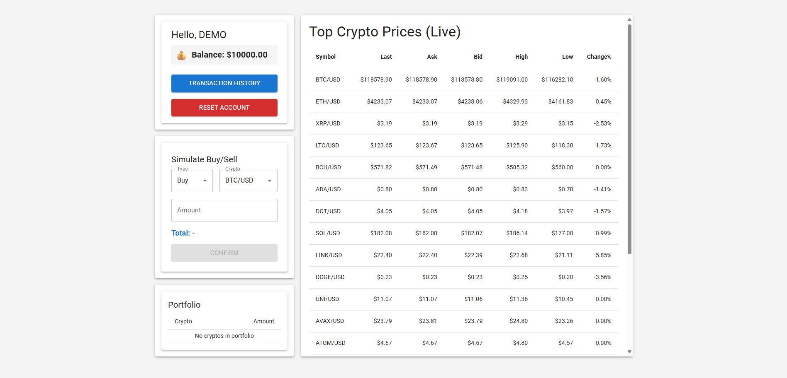
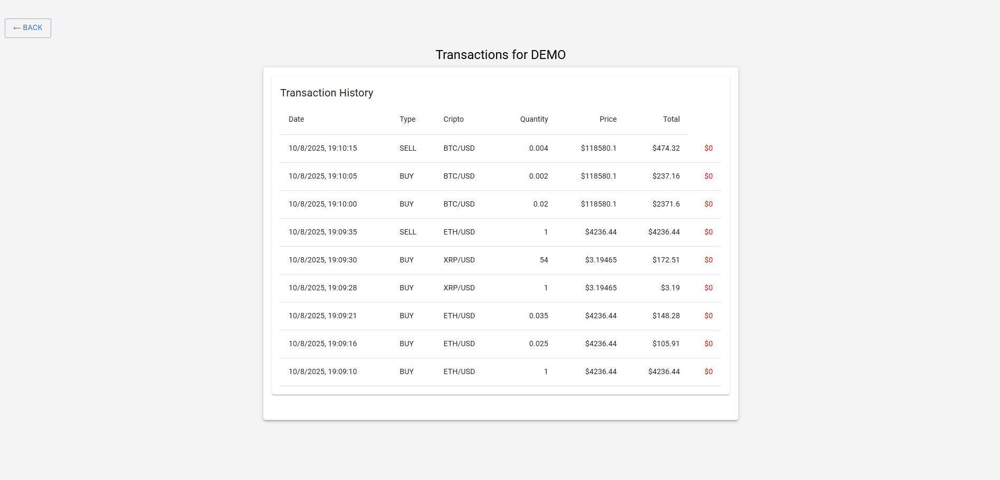

# Crypto Trading Simulator

A full-stack web application simulating cryptocurrency trading with real-time price updates, virtual account management, and transaction history.

## Features

- **Display Top 20 Crypto Prices:**  
  Real-time dynamic updates of the top 20 cryptocurrencies by price. Displays name, symbol, and current price in a clean table.

- **Account Balance and Transactions:**

  - Virtual account initialized with $10,000 starting balance.
  - Users can buy/sell cryptocurrencies by specifying amounts.
  - Buying deducts cost (quantity \* price) from balance.
  - Selling adds proceeds (quantity \* price) to balance.
  - Prevents buying beyond available balance.
  - Clear error messages for invalid inputs (e.g., negative amounts).

- **Transaction History:**  
  Log of all buy/sell transactions showing profit/loss status.

- **Reset Button:**  
  Resets virtual account balance to initial value and clears holdings.

## Backend

- **Technology:** Java 21 (OpenJDK 21.0.8), Spring Boot with Maven
- **Database:** PostgreSQL 17.5 (`crypto_sim_db`) with user `root` and password `password`
- **Database Migrations:** Flyway
- **Code Utilities:** Lombok for cleaner code
- **Data Access:** Direct SQL queries only (JPA or ORMs are _not_ used)
- **API:** RESTful services for prices, transactions, and account management
- **Integration Tests:** JUnit, Mockito with Testcontainers

## Frontend

- **Technology:** React 18 + Vite
- **UI Library:** Material UI for components
- **HTTP Client:** Axios
- **Routing:** react-router-dom

---

# Installation

### Prerequisites

- Java 21 SDK (or above, compiled with language level 24)
- Node.js and npm
- PostgreSQL 17.5
- Docker (To run PostgreSQL and Testcontainer Integration Tests)

### PostgreSQL Setup

#### Run PostgreSQL via Docker

```bash
docker run --name postgres-crypto -e POSTGRES_DB=crypto_sim_db -e POSTGRES_USER=root -e POSTGRES_PASSWORD=password -p 5432:5432 -d postgres:17.5
```

### Backend Setup

```bash
cd backend
./mvnw clean install
./mvnw spring-boot:run
```

The backend runs by default at http://localhost:8080

Database config is in src/main/resources/application.properties (update if needed)

### Run Integration Tests

Integration tests use Testcontainers with a real PostgreSQL container. Ensure you have Docker running locally before running the tests.

To run integration tests:

```bash
cd backend
./mvnw test
```

This will start the PostgreSQL container automatically for tests and run all unit and integration tests.

### Frontend Setup

```bash
cd frontend
npm install
npm run dev
```

The frontend runs by default at http://localhost:5173

Proxy or environment variables point API requests to backend

## Usage

Access the app via browser at http://localhost:5173, to view live top 20 crypto prices updated in real-time, also to buy or sell cryptocurrencies using your virtual account balance. Moreover, you can use the reset button to restart with initial balance and empty holdings:


Lastely, view transaction history with profit/loss details:


## Project Structure

```bash
crypto-trading-sim/
├── README.md
├── backend/            # Spring Boot Java backend project
│   ├── src/
│   ├── pom.xml
│   └── ...
└── frontend/           # React + Vite frontend project
    ├── src/
    ├── package.json
    └── ...
```

## Notes

- Security is not implemented as this is a simulated environment.
- No ORM used; all database interactions use raw SQL queries for simplicity and control.
- Flyway manages DB migrations; DDL scripts are included in the backend resources.

## License

This project is licensed under the MIT License.
